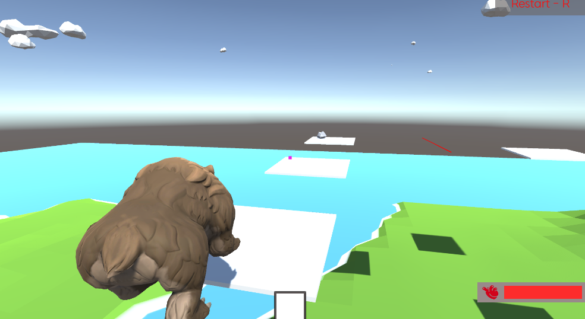

# 🐻 날아라 곰탱이

🎉 **날아라 곰탱이** 게임에 오신 것을 환영합니다!  
발판을 넘으며 곰탱이를 목적지까지 안전하게 데려다 주세요!

---

## 📁 스크립트 설명서

아래 링크에서 각 폴더별 상세 README를 확인할 수 있습니다.

- [🎒 Item 폴더 설명서](https://github.com/Neronem/Easy3D/blob/develop/Easy3D/Assets/Scripts/Item/README.md)  
  아이템 관련 스크립트 및 아이템 관리 기능

- [🧱 Obstacle 폴더 설명서](https://github.com/Neronem/Easy3D/blob/develop/Easy3D/Assets/Scripts/Obstacle/README.md)  
  플레이어 이동 경로상의 장애물 및 상호작용 요소

- [🎮 Player 폴더 설명서](https://github.com/Neronem/Easy3D/blob/develop/Easy3D/Assets/Scripts/Player/README.md)  
  플레이어 이동, 상태, 아이템 사용 등 핵심 플레이어 기능

- [🖥️ UI 폴더 설명서](https://github.com/Neronem/Easy3D/blob/develop/Easy3D/Assets/Scripts/UI/README.md)  
  게임 인터페이스, 인벤토리, 게임오버, 상호작용 UI 관리

- [🔗 InterfaceGroup 폴더 설명서](https://github.com/Neronem/Easy3D/blob/develop/Easy3D/Assets/Scripts/InterfaceGroup/README.md)  
  게임 내 인터페이스 정의

---

## 이렇게 하는게 맞나싶어서 튜터님께 확인받고자 브랜치는 일부러 지우지않고 남겨두었습니다 